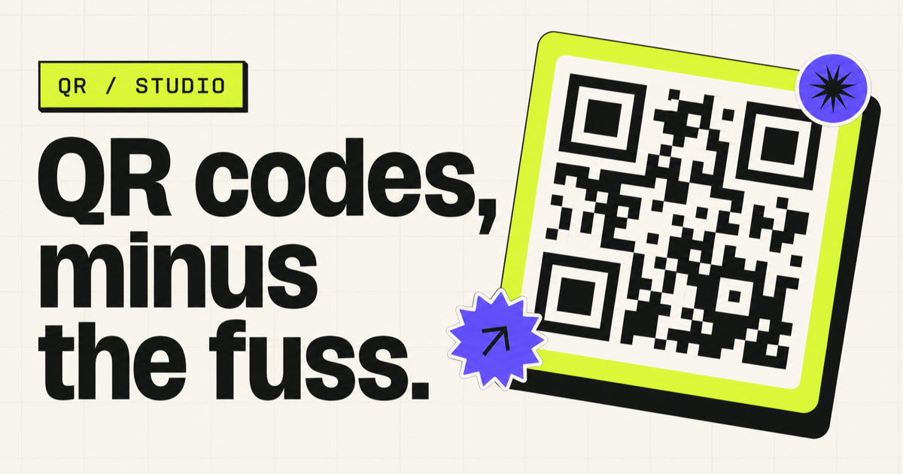

# Local QR Studio

QR Studio is a privacy-first QR code generator and reader that runs entirely
in the browser. It creates customizable QR codes, exports PNG and SVG images,
and reads QR codes from a camera or image file without sending user data to a
server.

## Features

- Generate QR codes from URLs or plain text
- Customize image size, error correction, colors, and quiet zone
- Copy generated QR codes directly to the clipboard
- Download QR codes as PNG or SVG
- Scan supported visual codes with a device camera
- Read QR, Micro QR, Aztec, Data Matrix, PDF417, UPC/EAN, Code 39/93/128,
  Codabar, ITF, and DataBar from PNG, JPG, WebP, and GIF images
- Light and dark themes with native browser color-scheme support
- Responsive layout for desktop and mobile devices
- Static deployment with no backend or account system

## Privacy

QR content, uploaded images, and camera frames are processed locally in the
browser. The application does not transmit or store any data.

## Requirements

- Node.js 20 or later for local development
- A modern browser with JavaScript enabled
- Local server or HTTPS for camera access in production

## Local Development

```bash
npm install
npm run dev
```

## Production Build

```bash
npm run build
```

The build creates:

- `dist/` — local production output
- `docs/` — committed static files for GitHub Pages

The generated `index.html` is self-contained and can also be opened directly
from the local filesystem. Camera access requires HTTPS or a local development
server.

## Technology

- React
- TypeScript
- Vite
- qrcode
- qr-scanner
- ZXing
- Lucide

## Project Structure

```text
docs/       GitHub Pages website
scripts/    Build utilities
src/        Application source
```


